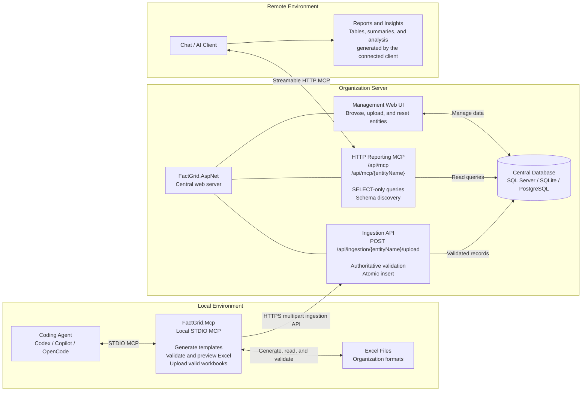

# FactGrid

Excel data entry and centralized reporting through a dual-MCP architecture.

## Overview

FactGrid turns organization-defined Excel workbooks into validated, centrally stored data that AI clients can query through MCP.

It has two MCP servers with separate responsibilities:

- **`FactGrid.Mcp`** runs locally over STDIO. It generates Excel templates, validates completed workbooks, previews records, and uploads valid files.
- **`FactGrid.AspNet`** runs on the organization server. It validates uploads again, stores data, serves the management web UI, and exposes reporting tools over Streamable HTTP MCP.

Both hosts use the shared **`FactGrid`** library as the single source of truth for entity models, Excel column metadata, parsing, validation, template generation, and entity discovery.

## Architecture

### End-to-End Flow

1. A local coding agent asks `FactGrid.Mcp` to generate an entity-specific `.xlsx` template.
2. A user fills in the workbook, then asks the local MCP server to validate and preview it.
3. `FactGrid.Mcp` uploads the workbook to the central ingestion API.
4. `FactGrid.AspNet` re-parses the complete workbook and atomically inserts all records or none.
5. A remote AI client connects directly to the central HTTP MCP to run SELECT-only queries and produce reports or insights.

Uploads use the dedicated HTTPS ingestion API, not MCP. Reporting uses MCP. Phase 3 does not include built-in dashboards or authentication; connected AI clients decide how query results are presented.

## Documentation

- [Getting Started](GETTING-STARTED.md) covers installation, configuration, MCP tools, API contracts, and operating the system.
- [AGENTS.md](AGENTS.md) contains repository structure, implementation patterns, and contributor verification requirements.

## Security

Phase 3 endpoints are unauthenticated. The ingestion API and reporting MCP routes provide explicit boundaries where authentication and authorization can be added later. Until then, place deployments behind appropriate network controls and do not expose them directly to untrusted clients.

## License

MIT
