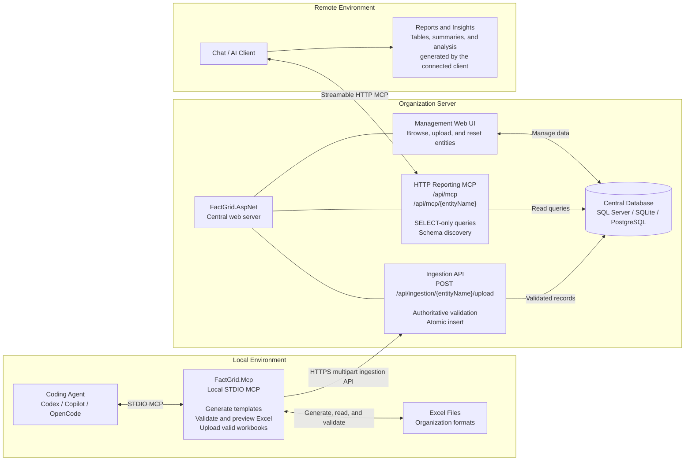

# FactGrid

Excel data entry and centralized reporting through a dual-MCP architecture.

## Overview

FactGrid turns organization-defined Excel workbooks into validated, centrally stored data that AI clients can query through MCP.

It has two MCP servers with separate responsibilities:

- **`FactGrid.Mcp`** runs locally over STDIO. It generates Excel templates, validates completed workbooks, previews records, and uploads valid files.
- **`FactGrid.AspNet`** runs on the organization server. It validates uploads again, stores data, serves the management web UI, and exposes reporting tools over Streamable HTTP MCP.

Both hosts use the shared **`FactGrid`** library as the single source of truth for entity models, Excel column metadata, parsing, validation, template generation, and entity discovery.

## Architecture



### End-to-End Flow

1. A local coding agent asks `FactGrid.Mcp` to generate an entity-specific `.xlsx` template.
2. A user fills in the workbook, then asks the local MCP server to validate and preview it.
3. `FactGrid.Mcp` uploads the workbook to the central ingestion API.
4. `FactGrid.AspNet` re-parses the complete workbook and atomically inserts all records or none.
5. A remote AI client connects directly to the central HTTP MCP to run SELECT-only queries and produce reports or insights.

Uploads use the dedicated HTTPS ingestion API, not MCP. Reporting uses MCP. Phase 3 does not include built-in dashboards or authentication; connected AI clients decide how query results are presented.

## Capabilities

### Local Data Entry MCP

| Tool | Description |
|---|---|
| `generate_template(entityName, outputPath)` | Generates a typed and formatted `.xlsx` template with headers and an example row |
| `validate_excel(entityName, filePath)` | Parses a workbook and returns a record preview plus validation errors without changing the database |
| `upload_excel(entityName, filePath)` | Uploads a workbook to the central ingestion API and returns its structured result |
| `list_entities()` | Lists registered entities, descriptions, and Excel column metadata |

### Central Reporting MCP

| Capability | Description |
|---|---|
| `sql_query(query)` | Executes SELECT-only SQL against allowed registered entity tables |
| `describe()` | Returns entity schema derived from model metadata |
| `entities://list` | MCP resource listing registered entities |
| `entities://schema` | MCP resource describing entity schemas |
| `entities-guide` | MCP prompt explaining available entities and querying |
| `entity-guide` | MCP prompt for the current scoped entity |

The global endpoint at `/api/mcp` can query all registered entities. Scoped endpoints at `/api/mcp/{entityName}` restrict queries to one entity.

### Ingestion API

`POST /api/ingestion/{entityName}/upload` accepts a multipart `.xlsx` file and always returns structured JSON:

```json
{
  "success": true,
  "insertedCount": 42,
  "errors": []
}
```

The server treats its own parsing and validation as authoritative. If any validation error exists, `insertedCount` is `0` and no records are stored.

## Getting Started

### Prerequisites

- .NET 10 SDK
- SQL Server, SQLite, or PostgreSQL
- An MCP-capable local coding agent

### Start the Organization Server

```bash
git clone https://github.com/khurram-uworx/FactGrid
cd FactGrid
dotnet run --project src/FactGrid.AspNet
```

Set `Storage:Provider` and the matching connection string in `src/FactGrid.AspNet/appsettings.json`. Supported provider values are `sqlserver`, `sqlite`, and `postgresql`.

The web UI is available at `/Entity`. The reporting MCP endpoints are available at `/api/mcp` and `/api/mcp/{entityName}`.

### Configure the Local STDIO MCP

Set `FACTGRID_SERVER_URL` to the base URL of the running organization server. For example:

```json
{
  "servers": {
    "factgrid-mcp": {
      "type": "stdio",
      "command": "dotnet",
      "args": [
        "run",
        "--project",
        "src/FactGrid.Mcp/FactGrid.Mcp.csproj"
      ],
      "env": {
        "FACTGRID_SERVER_URL": "http://localhost:5000"
      }
    }
  }
}
```

The STDIO process writes protocol messages to standard input/output, reads local workbook paths, and sends uploads to the configured organization server.

### Connect a Reporting Client

Connect an MCP-capable remote AI client to either:

- `/api/mcp` for access to every registered entity.
- `/api/mcp/{entityName}` for entity-scoped access.

FactGrid uses JSON-RPC 2.0 over Streamable HTTP. Requests must accept both `application/json` and `text/event-stream`.

Example scoped query:

```http
POST /api/mcp/expenses
Content-Type: application/json
Accept: application/json, text/event-stream

{
  "jsonrpc": "2.0",
  "id": 1,
  "method": "tools/call",
  "params": {
    "name": "sql_query",
    "arguments": {
      "query": "SELECT * FROM Expenses WHERE Amount > 100"
    }
  }
}
```

## Shared Entity Contract

The `FactGrid` class library defines the complete entity contract used by both MCP hosts:

- Entity models use EF mapping attributes and `[Description]` metadata for persistence and reporting schemas.
- `[ExcelColumn]` metadata defines workbook column positions, titles, required fields, examples, and formatting.
- Metadata-driven template generation and parsing use the same column definitions.
- Entity-specific parsers apply domain validation that cannot be expressed through common metadata.
- `FactGridEntityCatalog` is the only supported-entity registration list.

Adding or changing an entity does not require duplicate registration or Excel column definitions in either host.

## Adding an Entity

1. Add the entity model in `src/FactGrid/Models` with EF mapping, `[Description]`, and `[ExcelColumn]` metadata.
2. Add its entity-specific parser in `src/FactGrid/Services`.
3. Register the model and parser once in `FactGridEntityCatalog`.
4. Add its `DbSet<T>` to `ApplicationDbContext`.
5. Create and apply the EF migration:

```bash
dotnet ef migrations add AddEntity --project src/FactGrid.AspNet
dotnet ef database update --project src/FactGrid.AspNet
```

The local MCP tools, ingestion API, web UI, reporting MCP endpoints, resources, and prompts discover the entity through the shared catalog.

## Project Structure

```text
src/
├── FactGrid/               Shared models, Excel metadata, parsers, templates, and entity catalog
├── FactGrid.Mcp/           Local STDIO MCP for Excel data entry
└── FactGrid.AspNet/        Central ingestion API, database, web UI, and HTTP reporting MCP
tests/
└── FactGrid.Tests/         Shared library and host integration tests
```

## Build and Test

```bash
dotnet build src/FactGrid.AspNet
dotnet build src/FactGrid.Mcp
dotnet test tests/FactGrid.Tests
```

## Security

Phase 3 endpoints are unauthenticated. The ingestion API and reporting MCP routes provide explicit boundaries where authentication and authorization can be added later. Until then, place deployments behind appropriate network controls and do not expose them directly to untrusted clients.

## License

MIT
